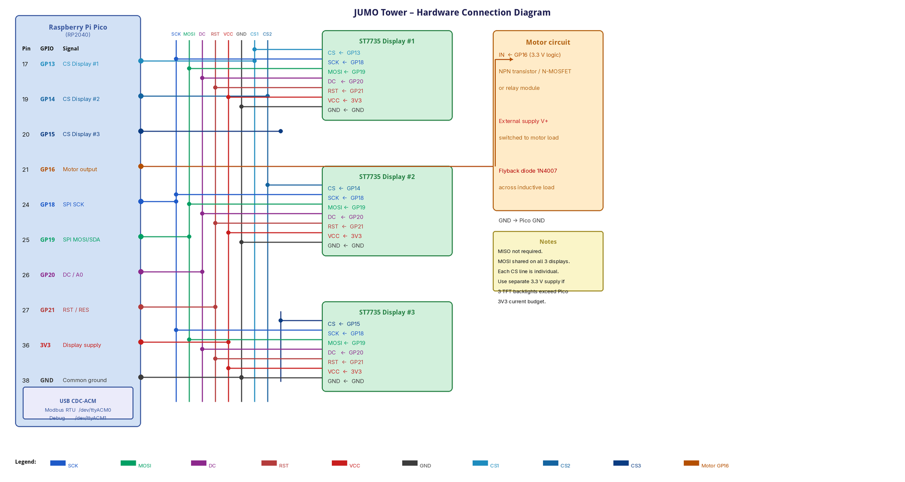

# modbus-jumo-tower

Firmware for a **Raspberry Pi Pico (RP2040)** that acts as a Modbus RTU slave over USB CDC-ACM.
It drives three ST7735 TFT displays and a motor output, and can display a temperature value sent by the Modbus master.

The USB device enumerates as **JUMO / JUMO Tower**.

## Hardware

| Component | Detail |
|-----------|--------|
| MCU | Raspberry Pi Pico (RP2040) |
| Displays | 3 x ST7735 TFT, 128x160 pixels, shared SPI bus |
| SPI bus | SCK = GPIO 18, MOSI = GPIO 19 |
| Display control | CS1 = GPIO 13, CS2 = GPIO 14, CS3 = GPIO 15, DC = GPIO 20, Reset = GPIO 21 |
| Motor output | GPIO 16 (digital on/off) |
| Modbus transport | USB CDC-ACM (`/dev/ttyACM0`), 115200 baud |
| Debug output | Second USB CDC-ACM interface (`/dev/ttyACM1`), 115200 baud |

## Wiring

### Schematic


### Pin assignment

| Pico pin | GPIO | Signal | Connects to |
|----------|------|--------|-------------|
| 17 | GP13 | TFT CS1 | CS on ST7735 #1 |
| 19 | GP14 | TFT CS2 | CS on ST7735 #2 |
| 20 | GP15 | TFT CS3 | CS on ST7735 #3 |
| 21 | GP16 | Motor OUT | Base/Gate of driver transistor / relay IN |
| 24 | GP18 | SPI SCK | SCK on all ST7735 modules |
| 25 | GP19 | SPI MOSI | MOSI/SDA on all ST7735 modules |
| 26 | GP20 | TFT DC | DC/A0 on all ST7735 modules |
| 27 | GP21 | TFT Reset | RST/RES on all ST7735 modules |
| 36 | 3V3 | Power | VCC on the ST7735 modules |
| 38 | GND | Ground | GND on all peripherals |

### Notes

- **SPI connections:** connect `SCK`, `MOSI` (sometimes labelled `SDA`), `DC` (sometimes `A0`) and `RST`/`RES` to all three modules. Connect each module's `CS` only to its assigned Pico GPIO. `MISO` is not required.
- **Display variant:** the firmware uses the `INITR_GREENTAB` initialization for common 1.8-inch 128x160 modules. If the visible image is shifted, adjust `ST7735_INIT_OPTION` in [include/config.h](include/config.h) for the tab variant of the module.
- **Motor driver:** GP16 is a 3.3 V logic output. Use an NPN transistor, N-MOSFET, or a relay module with built-in driver. Add a **flyback diode** (e.g. 1N4007) across inductive loads.
- **Power:** three backlit TFT modules can exceed the current available from the Pico's 3V3 rail. Use a sufficiently rated 3.3 V supply when needed and always connect its ground to Pico GND.

## Build

Built with [PlatformIO](https://platformio.org/) using the Earle Philhower arduino-pico core.

```
pio run          # compile
pio run -t upload  # flash
```

The firmware version is injected automatically from the latest Git tag via `get_version.py`.

## Modbus Interface

- **Unit ID:** `1`
- **Baud rate:** `115200` (USB CDC-ACM – baud is advisory but required by the library)
- **Parity / stop bits:** library default (none / 1)

### Coils — FC01 read / FC05 write

| Address | Name | Description |
|---------|------|-------------|
| `0` | `COIL_MOTOR` | `1` = motor on, `0` = motor off |

### Holding Registers — FC03 read / FC06 write

| Address | Name | Type | Description |
|---------|------|------|-------------|
| `0`–`3` | `REG_DISP1_LINE1` | R/W | Display 1, line 1 — 8 ASCII chars packed 2 per register¹ |
| `4`–`7` | `REG_DISP1_LINE2` | R/W | Display 1, line 2 — 8 ASCII chars packed 2 per register¹ |
| `8`–`11` | `REG_DISP2_LINE1` | R/W | Display 2, line 1 — 8 ASCII chars packed 2 per register¹ |
| `12`–`15` | `REG_DISP2_LINE2` | R/W | Display 2, line 2 — 8 ASCII chars packed 2 per register¹ |
| `16`–`19` | `REG_DISP3_LINE1` | R/W | Display 3, line 1 — 8 ASCII chars packed 2 per register¹ |
| `20`–`23` | `REG_DISP3_LINE2` | R/W | Display 3, line 2 — 8 ASCII chars packed 2 per register¹ |
| `24`–`25` | `REG_TEMPERATURE_HIGH` / `REG_TEMPERATURE_LOW` | R/W | IEEE-754 `float` temperature in °C, high word first. |
| `26`–`27` | `REG_HUMIDITY_HIGH` / `REG_HUMIDITY_LOW` | R/W | IEEE-754 `float` relative humidity in %, high word first. |
| `28` | `REG_VERSION_MAJOR` | R | Firmware version — major component |
| `29` | `REG_VERSION_MINOR` | R | Firmware version — minor component |
| `30` | `REG_VERSION_PATCH` | R | Firmware version — patch component |
| `31` | `REG_EASTER_EGG` | R/W command | Self-resetting Easter Egg command. `1` melts text, `2` starts Tetromino, `3` launches the temperature rocket, `4` starts the Modbus packet journey, `5` starts the oscilloscope animation, and `6` starts Matrix rain on all displays. |

¹ **Text encoding:** each register holds two ASCII characters — high byte is the first character, low byte is the second. Four consecutive registers form one 8-character display line. Write null bytes (`0x00`) to pad shorter strings.

### Climate mode

Writing a finite IEEE-754 `float` to registers `24`–`25` switches **all three displays** into climate mode. The temperature uses text scaling `5 × 7` (width × height) near the top; relative humidity from registers `26`–`27` is shown near the bottom with scaling `3 × 5`. The larger vertical scale makes both lines use most of the display height without widening the text. Positive temperatures and relative humidity are formatted with one decimal place, for example `21.0C` and `48.5%`; negative temperatures are rounded to whole degrees, for example `-5C`.

The four registers form two adjacent 32-bit IEEE-754 floats in high-word-first order:

| Registers | Value | Example IEEE-754 bytes |
|-----------|-------|------------------------|
| `24`–`25` | Temperature in °C | `21.0` = `0x41A80000` |
| `26`–`27` | Relative humidity in % | `48.5` = `0x42420000` |

Use FC16 to write both floats together. With `mbpoll`, the following command sends `21.0C` and `48.5%` in one request:

```bash
mbpoll -m rtu -a 1 -b 115200 -P none \
	-0 -r 24 -t 4:float -B -1 \
	/dev/ttyACM0 21.0 48.5
```

`-0` makes `mbpoll` use the firmware's zero-based register addresses, `-t 4:float` encodes each value as a 32-bit holding-register float, and `-B` selects high-word-first order. The first argument after the device is always the temperature; the second is the relative humidity.

For a negative temperature, place `--` before the values so `mbpoll` does not interpret the minus sign as an option:

```bash
mbpoll -m rtu -a 1 -b 115200 -P none \
	-0 -r 24 -t 4:float -B -1 \
	/dev/ttyACM0 -- -5.0 48.5
```

To inspect the four raw words after writing, use:

```bash
mbpoll -m rtu -a 1 -b 115200 -P none \
	-0 -r 24 -c 4 -t 4:hex -1 \
	/dev/ttyACM0
```

Display text registers (`0`–`23`) are ignored while climate mode is active. To restore normal text mode, write `0xFFFF` to both temperature registers (`24` and `25`).

### Easter Eggs

Writing an Egg ID to register `31` starts it simultaneously on all three displays. The firmware processes every non-zero value as a command and immediately resets the register to `0`, so writing the same ID again starts a new animation. Unknown IDs are ignored after the reset.

| ID | Effect |
|----|--------|
| `1` | Melts the currently visible text downward for 10 seconds. Text and climate views are both supported. |
| `2` | Runs a 10-second Tetromino animation: a four-block piece falls into a gap, completes four rows, and clears them. |
| `3` | Runs a 10-second temperature rocket: a gauge heats from `20C` to `99C`, followed by a countdown and launch. |
| `4` | Runs a 10-second Modbus packet journey: a `01 03` packet travels from node 1 to node 3 and ends with `CRC OK`. |
| `5` | Runs a 10-second oscilloscope animation with a trigger line and a phase-shifted signal on each display. |
| `6` | Runs 10 seconds of Matrix-style character rain; `JUMO` appears twice in the center of the falling characters. |

While an Egg is running, updates to the display or climate registers are retained. When it finishes, each display renders the latest underlying view.

Use FC06 to start the melting-text Egg with `mbpoll`:

```bash
mbpoll -m rtu -a 1 -b 115200 -P none \
	-0 -r 31 -t 4 -1 \
	/dev/ttyACM0 1
```

## Debug output

The second USB CDC-ACM interface (`/dev/ttyACM1`) provides startup, display-update, motor-state, and temperature-mode messages at 115200 baud. It is separate from the Modbus interface on `/dev/ttyACM0`.

## License

GPL-3.0-or-later — see [LICENSE](LICENSE).

